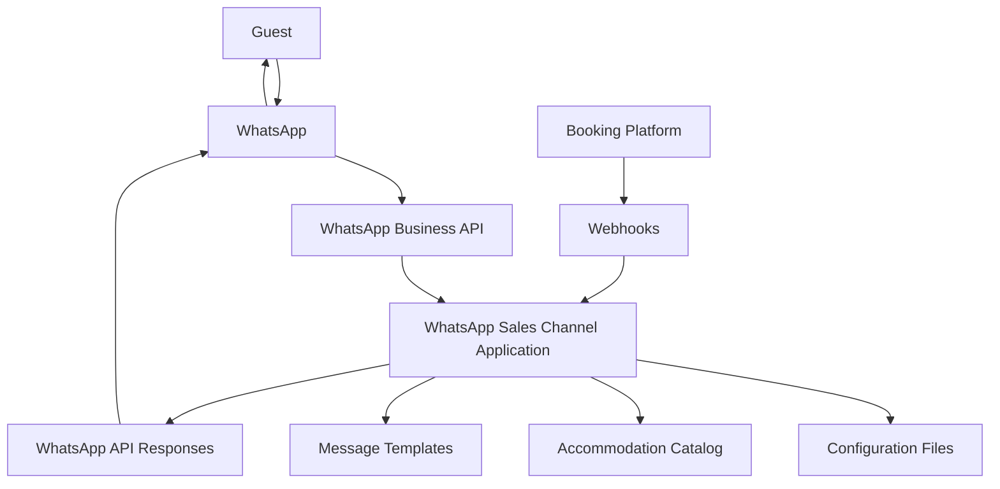
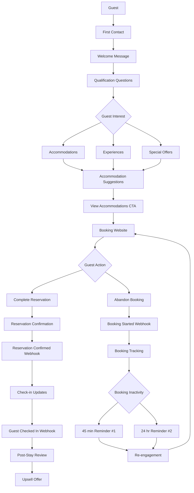
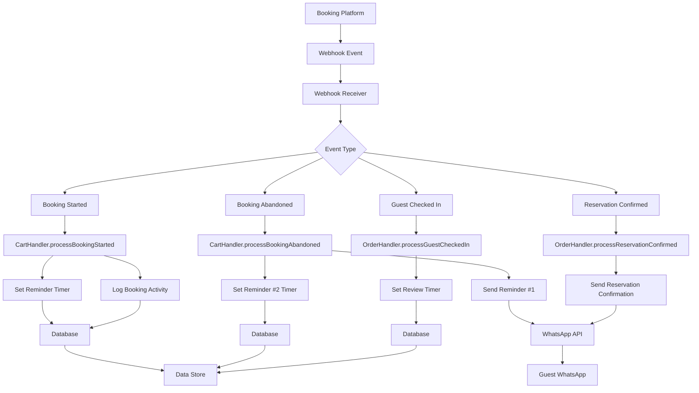
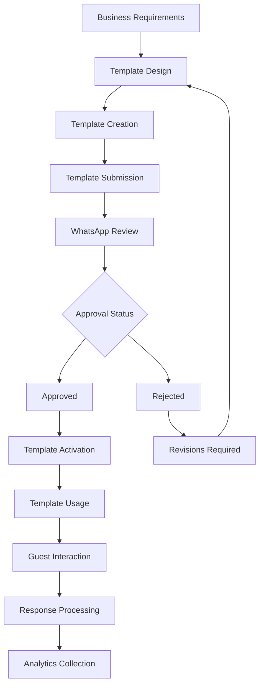

# WhatsApp Sales Channel Project Planning & Flow Summary for Resort Owners

This document provides a comprehensive overview of the WhatsApp Sales Channel project planning and system flows for client review and approval.

## Executive Summary

The WhatsApp Sales Channel project transforms WhatsApp into a powerful sales channel for resort accommodations and experiences through automated messaging flows. The solution guides guests from initial contact through post-stay engagement, with the goal of increasing bookings and enhancing guest experience.

## Project Planning Overview

### Objectives
1. Increase booking conversion rates through WhatsApp-based guest engagement
2. Automate guest journey from first contact to post-stay follow-up
3. Recover abandoned bookings through timely reminders
4. Enhance guest experience with personalized accommodation recommendations

### Timeline
- **Phase 1: Foundation** (Week 1) - Setup and core architecture
- **Phase 2: Guest Journey Implementation** (Week 2) - All 5 guest journey stages
- **Phase 3: Integration & Testing** (Week 3) - Booking platform integration and testing
- **Phase 4: Deployment** (Week 4) - Production deployment and documentation

### Budget Estimate
- Development: 4 weeks of development time
- WhatsApp API costs: Variable based on message volume
- Server hosting: Monthly recurring cost

## System Architecture Flow

The system integrates with the client's existing booking platform through webhooks, processes guest interactions through the WhatsApp Sales Channel application, and sends automated messages back to guests via the WhatsApp Business API.

## Guest Journey Flow

The guest journey consists of five stages:
1. **First Contact & Qualification** - Welcome message and intent qualification
2. **Accommodation Suggestions** - Curated recommendations based on interest
3. **Booking Abandonment Recovery** - Automated reminders for incomplete bookings
4. **Reservation Management** - Confirmation and check-in updates
5. **Post-Stay Engagement** - Reviews and upsell opportunities

## Webhook Processing Flow

The system processes four types of webhook events from the booking platform:
1. `booking_started` - Triggers booking monitoring
2. `booking_abandoned` - Triggers reminder sequence
3. `reservation_confirmed` - Triggers confirmation message
4. `guest_checked_in` - Triggers post-stay sequence

## Message Template Lifecycle

Seven key message templates are required:
1. `welcome_qualifier` - First contact and qualification
2. `product_suggestions` - Curated accommodation recommendations
3. `cart_reminder_1` - First booking abandonment reminder
4. `cart_reminder_2` - Second booking abandonment reminder
5. `order_confirmation` - Reservation confirmation
6. `post_purchase_review` - Review request
7. `upsell_offer` - Complementary experience offer

## Key Success Metrics

- **Booking abandonment recovery rate increase**: Target 15%
- **Conversion rate improvement**: Target 10%
- **Guest engagement rate**: Target 25%
- **Average booking value increase**: Target 8%
- **Message delivery rates**: >95%
- **System uptime**: >99.5%

## Next Steps

1. Client approval of project plan and timeline
2. Completion of Client Information Checklist
3. Setup of WhatsApp Business API account
4. Begin template creation and approval process
5. Schedule project kickoff meeting

This comprehensive solution provides a clear roadmap for implementing a powerful WhatsApp sales channel that will drive increased bookings and enhanced guest engagement for your resort.