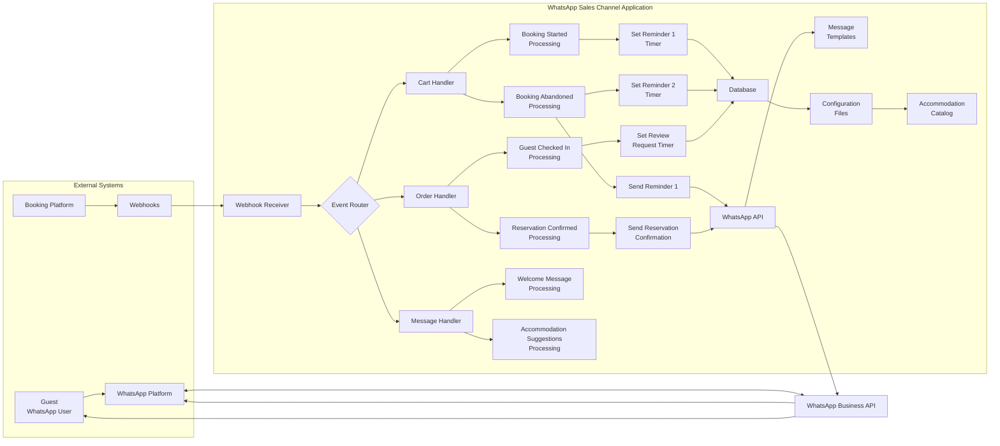

# Complete WhatsApp Sales Channel System Flow for Resort Owners

## Overview

This document provides a comprehensive view of all system flows within the WhatsApp Sales Channel implementation, showing how different components interact to deliver the complete guest experience for resort owners.

## Complete System Flow Diagram

## Component Interactions

### Guest Initiated Flows

1. **First Contact Flow**
   - Guest clicks "Chat on WhatsApp" button, scans QR code, or uses Click-to-WhatsApp ad
   - WhatsApp delivers message to WhatsApp Business API
   - Application receives message through WhatsApp API
   - Message Handler processes welcome message
   - Application sends `welcome_qualifier` template to guest
   - Guest responds with interest selection
   - Application receives response and tags guest intent
   - Accommodation Suggestions Processing retrieves relevant accommodations
   - Application sends `product_suggestions` template to guest

2. **Accommodation Browsing Flow**
   - Guest receives accommodation suggestions
   - Guest clicks "View Accommodations" button
   - Guest browses accommodations on booking website
   - Guest adds accommodations to booking

### System Initiated Flows

3. **Booking Started Flow**
   - Booking platform sends `booking_started` webhook
   - Webhook Receiver validates and parses event
   - Event Router directs to Cart Handler
   - Booking Started Processing logs booking details
   - Booking Started Processing sets Reminder 1 timer (45 minutes)
   - Database stores booking information

4. **Booking Abandonment Flow**
   - Booking platform sends `booking_abandoned` webhook OR timer expires
   - Webhook Receiver validates and parses event
   - Event Router directs to Cart Handler
   - Booking Abandoned Processing sends Reminder 1 immediately
   - Booking Abandoned Processing sets Reminder 2 timer (20-24 hours)
   - Database updates booking status

5. **Reservation Processing Flow**
   - Booking platform sends `reservation_confirmed` webhook
   - Webhook Receiver validates and parses event
   - Event Router directs to Order Handler
   - Reservation Confirmed Processing sends reservation confirmation
   - Database stores reservation details

6. **Post-Stay Flow**
   - Booking platform sends `guest_checked_in` webhook
   - Webhook Receiver validates and parses event
   - Event Router directs to Order Handler
   - Guest Checked In Processing sets review request timer (2-3 days)
   - Database updates reservation status
   - Review timer expires
   - Order Handler sends `post_purchase_review` template
   - After guest response or delay, Order Handler sends `upsell_offer` template

## Data Flow Between Components

### Configuration Data
- Configuration Files → All Handlers (timing, branding)
- Accommodation Catalog → Message Handler (accommodation data)
- Message Templates → All Handlers (message formatting)

### Guest Data
- Guest → WhatsApp Platform → WhatsApp Business API → Message Handler
- Message Handler → WhatsApp Business API → WhatsApp Platform → Guest

### Event Data
- Booking Platform → Webhooks → Webhook Receiver → Event Router
- Event Router → Cart Handler/Order Handler
- Cart Handler/Order Handler → Database (storage)
- Cart Handler/Order Handler → WhatsApp API (messages)

### Message Data
- Message Templates → Message Handler (formatting)
- Message Handler → WhatsApp API (sending)
- WhatsApp API → WhatsApp Platform → Guest (delivery)

## Timing and Scheduling

### Real-time Processing
- Guest messages: Processed immediately
- Webhook events: Processed immediately
- Reservation confirmations: Sent immediately after reservation placement

### Scheduled Processing
- Booking Reminder 1: 45 minutes after booking inactivity
- Booking Reminder 2: 20-24 hours after booking inactivity
- Review Request: 2-3 days after guest check-in
- Upsell Offer: Sent after review request processing

## Error Handling and Recovery

### Webhook Processing Errors
- Invalid payloads: Logged and rejected with appropriate HTTP status
- Missing data: Logged and queued for manual review
- Processing failures: Retried with exponential backoff

### Message Sending Errors
- WhatsApp API failures: Retried up to 3 times
- Template errors: Fallback to generic messages
- Delivery failures: Logged and reported for analytics

### Data Storage Errors
- Database connection issues: Retried with backoff
- Data integrity issues: Logged and queued for manual correction

## Security and Compliance

### Data Protection
- Guest phone numbers: Encrypted at rest
- Personal information: Handled according to privacy regulations
- API credentials: Stored securely with limited access

### Communication Security
- All API communications: HTTPS encrypted
- Webhook endpoints: Protected with authentication
- Data transmission: Secure protocols

### Compliance
- GDPR/CCPA: Guest data handled with appropriate safeguards
- WhatsApp Policies: All messages comply with platform requirements
- Industry Standards: Following best practices for data security

## Monitoring and Analytics

### Real-time Monitoring
- Webhook receipt rates
- Message delivery rates
- System response times
- Error rates and types

### Business Metrics
- Conversion rates at each stage
- Booking abandonment recovery rates
- Guest engagement levels
- Revenue attribution

### Performance Metrics
- System uptime
- Processing latency
- Resource utilization
- Scalability indicators

This comprehensive flow diagram shows how all components of the WhatsApp Sales Channel system work together to deliver a seamless guest experience while maintaining robust technical operations for resort owners.