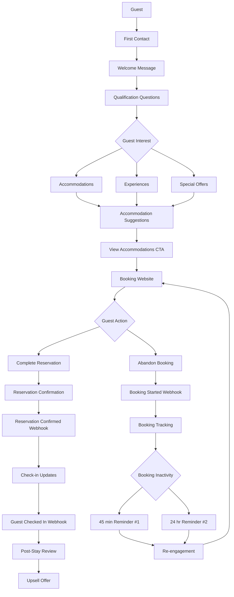

# WhatsApp Sales Channel Guest Journey for Resort Owners

## Overview

This document illustrates the complete guest journey through the WhatsApp Sales Channel, showing how guests interact with the system at each stage for resort owners.

## Complete Guest Journey Flow

## Stage-by-Stage Breakdown

### Stage 1: First Contact & Qualification
1. Guest initiates contact through:
   - "Chat on WhatsApp" button
   - QR code
   - Click-to-WhatsApp ad
2. System sends automated welcome message
3. Guest is asked qualifying questions about their interest
4. System tags guest intent for personalized experience

### Stage 2: Accommodation Suggestions
1. Based on guest interest, system selects relevant accommodations
2. System sends curated accommodation list with images and benefits
3. Guest can click "View Accommodations" to go to booking website
4. Guest browses and potentially adds accommodations to booking

### Stage 3: Booking Abandonment Recovery
1. When guest adds accommodations to booking, webhook notifies system
2. System begins monitoring booking activity
3. After 45 minutes of inactivity, Reminder #1 is sent
4. After 24 hours of inactivity, Reminder #2 is sent (optional)
5. Reminders include direct links to recover booking

### Stage 4: Reservation Management
1. When guest completes reservation, webhook notifies system
2. System sends reservation confirmation with details
3. System sends check-in updates as arrival date approaches
4. System tracks guest check-in status

### Stage 5: Post-Stay Engagement
1. 2-3 days after check-in, system sends review request
2. System sends upsell offer for complementary experiences
3. Guest can engage with review request or upsell offer
4. System tracks guest responses for future personalization

## Decision Points

### Qualification Path Selection
Guests choose from three interest paths:
- Accommodations (rooms and suites)
- Experiences (spa, dining, activities)
- Special Offers (packages and deals)

### Booking Abandonment Response
System determines when to send reminders based on:
- Time since last booking activity
- Configurable timing settings
- Guest engagement history

### Post-Stay Path
After check-in, system can:
- Request accommodation reviews
- Offer complementary experiences
- Both sequentially

## Integration Points

### Webhook Events
1. `booking_started` - Triggers booking monitoring
2. `booking_abandoned` - Triggers reminder sequence
3. `reservation_confirmed` - Triggers confirmation message
4. `guest_checked_in` - Triggers post-stay sequence

### WhatsApp Message Templates
1. `welcome_qualifier` - First contact message
2. `product_suggestions` - Curated accommodation recommendations
3. `cart_reminder_1` - First booking abandonment reminder
4. `cart_reminder_2` - Second booking abandonment reminder
5. `order_confirmation` - Reservation confirmation
6. `post_purchase_review` - Review request
7. `upsell_offer` - Complementary experience offer

## Timing Configuration

All timing is configurable in the system:
- Booking Reminder #1: 45 minutes (default)
- Booking Reminder #2: 24 hours (default)
- Post-Stay Review: 2-3 days (default)

## Success Indicators

At each stage, the system tracks:
- Message delivery rates
- Guest response rates
- Conversion rates
- Engagement metrics