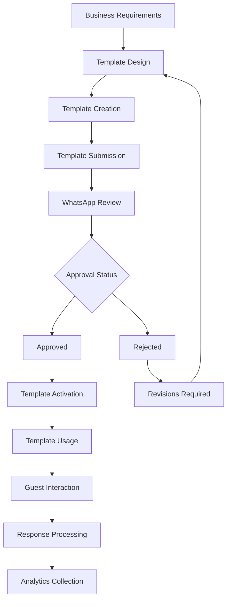
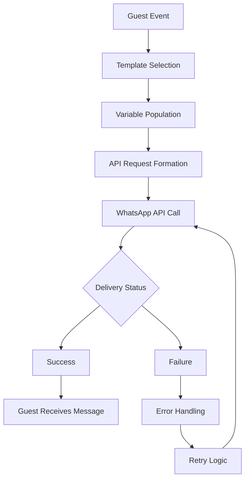

# Message Templates Flow for Resort Owners

## Overview

This document details the flow of message template creation, approval, and usage within the WhatsApp Sales Channel system for resort owners.

## Message Template Lifecycle

## Template Creation Process

### 1. Business Requirements
- Define guest journey touchpoints
- Identify required message types
- Determine personalization needs
- Establish brand voice and tone

### 2. Template Design
- Create message content with placeholders
- Design interactive elements (buttons, lists)
- Plan for localization requirements
- Ensure compliance with WhatsApp policies

### 3. Template Creation
- Format messages according to WhatsApp API specifications
- Include all required parameters
- Define language variations
- Set up fallback content

### 4. Template Submission
- Submit templates through business account
- Provide sample content for all placeholders
- Include use case descriptions
- Specify template categories

### 5. WhatsApp Review Process
- Automated initial validation
- Manual review by WhatsApp team
- Policy compliance checking
- Quality assessment

### 6. Approval Outcomes
**Approved Templates:**
- Activated for immediate use
- Available in template library
- Ready for API integration

**Rejected Templates:**
- Reasons provided for rejection
- Guidance for corrections
- Resubmission process

### 7. Template Activation
- Integration with WhatsApp API
- Testing in sandbox environment
- Production deployment
- Monitoring for delivery issues

## Required Templates

### Welcome & Qualification Templates
1. `welcome_qualifier`
   - Purpose: First contact and intent qualification
   - Components: Body text, 3 interactive buttons
   - Variables: Guest name

### Accommodation Suggestion Templates
1. `product_suggestions`
   - Purpose: Curated accommodation recommendations
   - Components: Header (category), body text, accommodation details, button
   - Variables: Category name, guest name, accommodation names, benefits, prices

### Booking Reminder Templates
1. `cart_reminder_1`
   - Purpose: First booking abandonment reminder
   - Components: Body text with booking details
   - Variables: Guest name, first accommodation name, resort name, booking URL

2. `cart_reminder_2`
   - Purpose: Second booking abandonment reminder
   - Components: Body text with final call to action
   - Variables: Guest name, resort name

### Reservation Management Templates
1. `order_confirmation`
   - Purpose: Reservation confirmation
   - Components: Body text with reservation details
   - Variables: Guest name, reservation ID, total amount, check-in date

### Post-Stay Templates
1. `post_purchase_review`
   - Purpose: Accommodation review request
   - Components: Body text, interactive button
   - Variables: Guest name, accommodation name

2. `upsell_offer`
   - Purpose: Complementary experience suggestion
   - Components: Body text, interactive button
   - Variables: Guest name, booked accommodation name, upsell experience name, price

## Template Usage Flow

## Variable Personalization

### Guest Data
- Name (from previous interactions or profile)
- Phone number (for message routing)
- Booking history (for recommendations)
- Preferences (from qualification questions)

### Accommodation Data
- Accommodation names
- Descriptions and benefits
- Pricing information
- Image URLs
- Category associations

### Contextual Data
- Booking contents
- Reservation details
- Check-in information
- Timing parameters

## Compliance Requirements

### WhatsApp Template Policies
- No promotional content in template headers
- Accurate sample values in submissions
- Clear call-to-action language
- Respect for user privacy and preferences

### Data Privacy Compliance
- GDPR compliance for European guests
- CCPA compliance for California guests
- Secure handling of personal information
- Opt-out mechanisms in all messages

## Testing and Validation

### Sandbox Testing
- Template approval in development environment
- Message rendering verification
- Variable substitution testing
- Interactive element functionality

### Production Testing
- Limited rollout to test users
- Delivery rate monitoring
- Response rate tracking
- Error rate analysis

## Maintenance and Updates

### Template Versioning
- Track changes to template content
- Maintain backward compatibility
- Coordinate with WhatsApp approval process
- Communicate changes to stakeholders

### Performance Monitoring
- Delivery success rates
- Read rates and response rates
- Guest feedback analysis
- A/B testing capabilities

### Continuous Improvement
- Regular review of template effectiveness
- Iterative optimization based on metrics
- Seasonal and promotional template updates
- Integration of new WhatsApp features