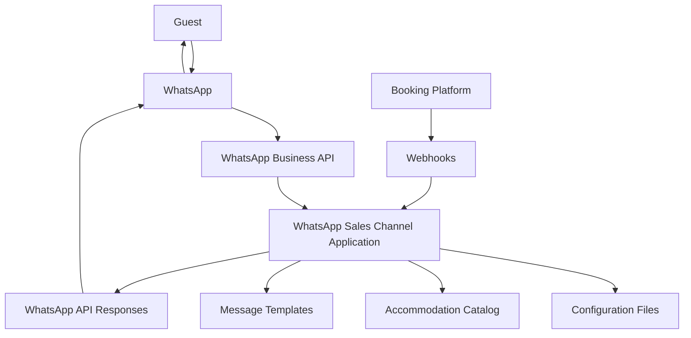

# WhatsApp Sales Channel System Architecture for Resort Owners

## Overview

This document provides a visual representation of the WhatsApp Sales Channel system architecture, showing how different components interact to deliver the guest experience for resort owners.

## System Components

## Component Descriptions

### Guest
The end user who interacts with the resort through WhatsApp.

### WhatsApp
The messaging platform used for guest communication.

### WhatsApp Business API
The official API provided by Meta for businesses to communicate with customers.

### WhatsApp Sales Channel Application
The core application that processes messages, events, and guest interactions.

### Configuration Files
JSON files that control application behavior, timing, and business rules.

### Accommodation Catalog
Database of suites and rooms with descriptions, pricing, and categorization.

### Message Templates
Pre-approved message formats required by WhatsApp Business API.

### Booking Platform
The resort's existing booking website or platform (Booking.com, Expedia, etc.).

### Webhooks
Real-time event notifications from the booking platform to the application.

### WhatsApp API Responses
Messages sent back to guests through the WhatsApp Business API.

## Data Flow

1. Guest sends a message to the resort WhatsApp number
2. WhatsApp forwards the message to the WhatsApp Business API
3. The application receives the message and processes it
4. Based on the message content and guest context, the application:
   - Retrieves relevant configuration
   - Accesses accommodation catalog for recommendations
   - Formats messages using templates
5. The application sends responses back through the WhatsApp Business API
6. Guest receives the response on their WhatsApp client
7. When guest interacts with the booking platform:
   - Webhooks notify the application of events (booking start, reservation confirmation, etc.)
   - Application triggers appropriate WhatsApp messages
8. Application logs all interactions for analytics and debugging

## Security Considerations

- All API communications use HTTPS encryption
- Guest data is handled according to privacy regulations
- Access tokens are stored securely
- Webhook endpoints are protected with authentication