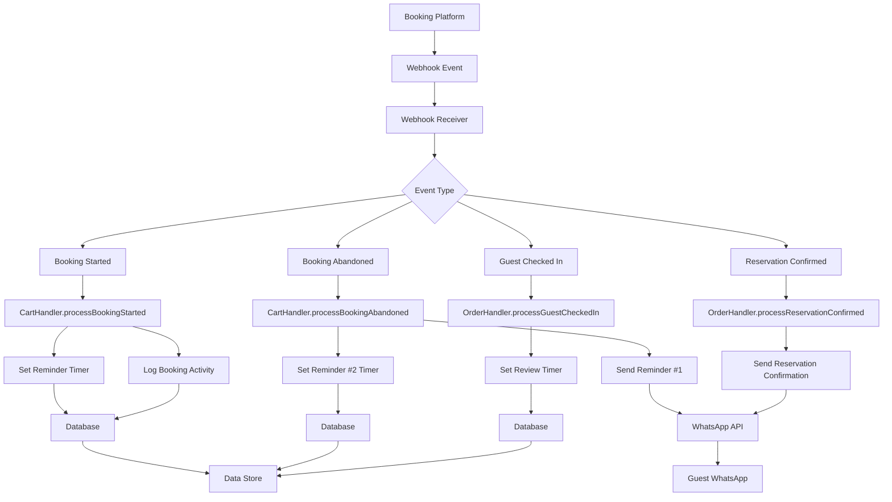

# Webhook Processing Flow for Resort Owners

## Overview

This document details the technical flow of how webhook events from the booking platform are processed by the WhatsApp Sales Channel application for resort owners.

## Webhook Event Processing Flow

## Detailed Flow Descriptions

### Booking Started Event Flow
1. Booking platform detects guest starting a reservation
2. Platform sends `booking_started` webhook to application endpoint
3. Webhook receiver validates and parses event data
4. Event is routed to CartHandler for processing
5. CartHandler logs booking creation in database
6. CartHandler sets timer for first abandonment reminder
7. System monitors booking activity for inactivity periods

### Booking Abandoned Event Flow
1. Booking platform or internal timer detects booking abandonment
2. Platform sends `booking_abandoned` webhook to application endpoint
3. Webhook receiver validates and parses event data
4. Event is routed to CartHandler for processing
5. CartHandler immediately sends Reminder #1 to guest
6. CartHandler sets timer for Reminder #2 (if enabled)
7. System updates booking status in database

### Reservation Confirmed Event Flow
1. Booking platform confirms reservation completion
2. Platform sends `reservation_confirmed` webhook to application endpoint
3. Webhook receiver validates and parses event data
4. Event is routed to OrderHandler for processing
5. OrderHandler sends reservation confirmation message to guest
6. OrderHandler logs reservation details in database
7. OrderHandler sets check-in tracking parameters

### Guest Checked In Event Flow
1. Booking platform or front desk system confirms guest check-in
2. Platform sends `guest_checked_in` webhook to application endpoint
3. Webhook receiver validates and parses event data
4. Event is routed to OrderHandler for processing
5. OrderHandler sets timer for post-stay review request
6. System updates reservation status in database

## Error Handling

### Webhook Reception Errors
- Invalid payload format: Log error and return 400 Bad Request
- Missing required fields: Log error and return 400 Bad Request
- Authentication failure: Log error and return 401 Unauthorized
- Server errors: Log error and return 500 Internal Server Error

### Processing Errors
- Database connection failure: Retry with exponential backoff
- WhatsApp API errors: Log error and queue for retry
- Invalid guest phone number: Log error and skip processing
- Template not found: Log error and use fallback message

### Retry Logic
- Failed database operations: Retry up to 3 times with 5-second delays
- Failed WhatsApp API calls: Retry up to 3 times with 10-second delays
- Persistent failures: Queue for manual review

## Security Measures

### Webhook Authentication
- HMAC signature verification for supported platforms
- IP whitelist for trusted sources
- Rate limiting to prevent abuse
- Payload validation and sanitization

### Data Protection
- Guest phone numbers encrypted at rest
- PII data handled according to privacy regulations
- Access logs for audit trails
- Secure token storage for API authentication

## Monitoring and Logging

### Key Metrics Tracked
- Webhook receipt rate
- Processing success rate
- Error rates by type
- Response time percentiles
- Retry attempt counts

### Logging Structure
- Incoming webhook details (timestamp, source, event type)
- Processing steps with timestamps
- Error details with context
- Outgoing message details
- System health metrics

## Scalability Considerations

### Load Handling
- Asynchronous processing for non-critical operations
- Message queues for high-volume scenarios
- Database connection pooling
- Horizontal scaling capabilities

### Performance Optimization
- Caching of frequently accessed configuration
- Database indexing for quick lookups
- Efficient payload parsing
- Minimal external dependencies during processing